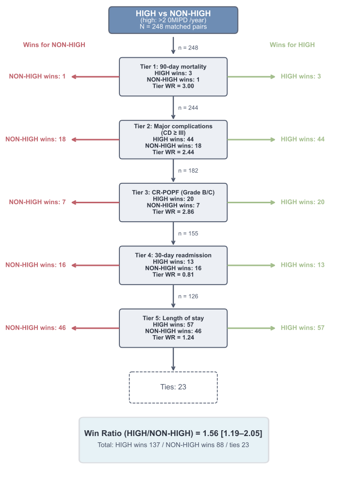

# Analysis Reproduction

The public analysis layer is intentionally limited to public-safe analytical materials. It does not include any manuscript-generation workflow.

The study example focuses on minimally invasive distal pancreatectomy. The main question is whether higher-volume centers outperform lower-volume centers on a prioritized postoperative hierarchy after propensity-score matching.

Files of interest:

- `data/public/distal_pancreatectomy_public.csv`
- `data/public/distal_pancreatectomy_manifest.json`
- `studies/distal_pancreatectomy/config/primary_analysis.yaml`
- `results/public/win_ratio_summary.json`
- `results/public/reproducibility_manifest.json`
- `results/public/example_flow_hv_vs_nonhigh.png`

The default committed dataset is synthetic. The export script can also process a protected registry export and apply the same public disclosure audit before writing a row-level public dataset.

Example output:

This flow diagram shows how matched pairs are resolved sequentially across mortality, major complications, clinically relevant pancreatic fistula, readmission, and length of stay. It is intended to help readers understand the interpretation of the win-ratio framework in this surgical setting.
